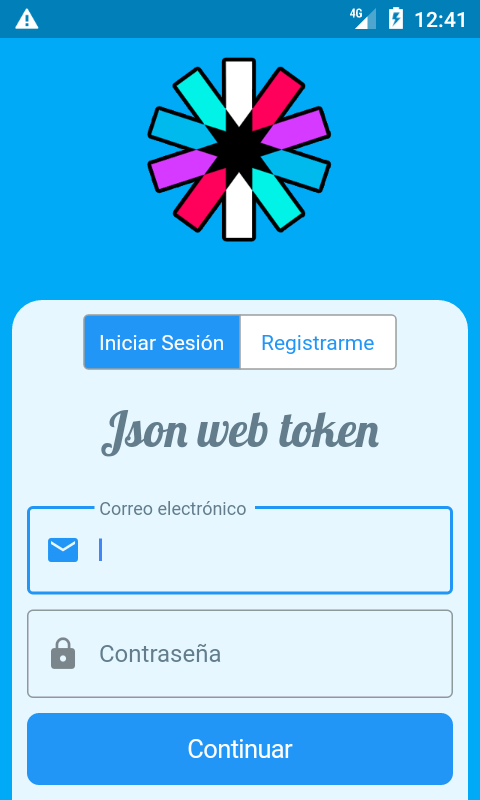
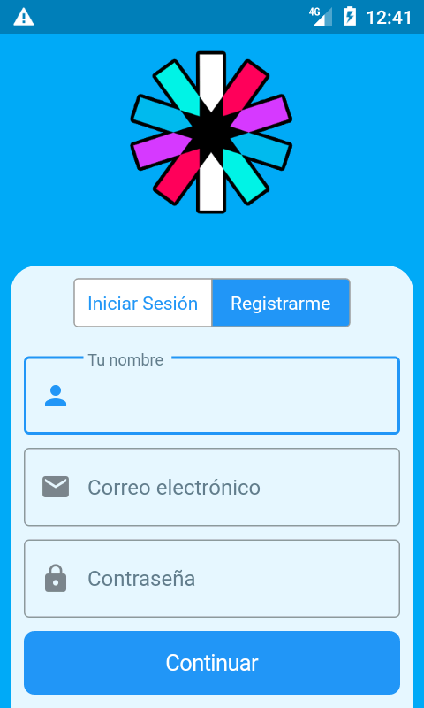

# JWT Login

> Please contribute and help Venezuelan programmers:
> [donate $5](https://www.paypal.com/cgi-bin/webscr?cmd=_donations&business=gregori.pineres02@gmail.com&item_name=Saving%20Venezuelan%20programmers&amount=5.00&currency_code=USD)

Una aplicación de flutter que integra un sistema de autenticación basado en JWT.

## Empezando

Para este ejemplo desarrollé una app de Express y la desplegué en [heroku](https://backend-jwt.herokuapp.com),
puedes clonar el [repositorio](https://github.com/gregorip02/jwt-backend) y correrlo en tu maquina si así lo prefieres.
Dependiendo de tu elección has algunos cambios en el archivo `lib/utils.dart`:

#### Backend remoto
```dart
String getBaseUri() =>
  inReleaseMode() ?
    'https://backend-jwt.herokuapp.com' : 'https://backend-jwt.herokuapp.com';
```

#### Backend local
```dart
String getBaseUri() =>
  inReleaseMode() ?
    'https://backend-jwt.herokuapp.com' : 'http://<your-ip>:<your-port>';
```

## Screenshots



